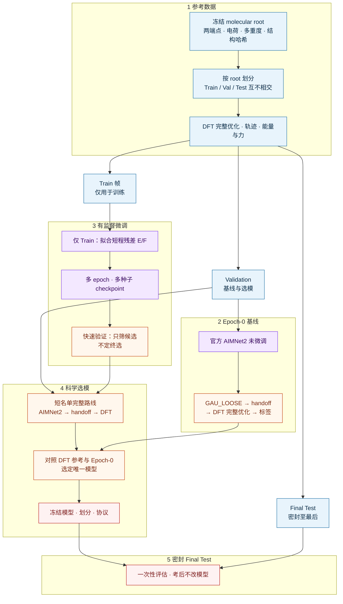
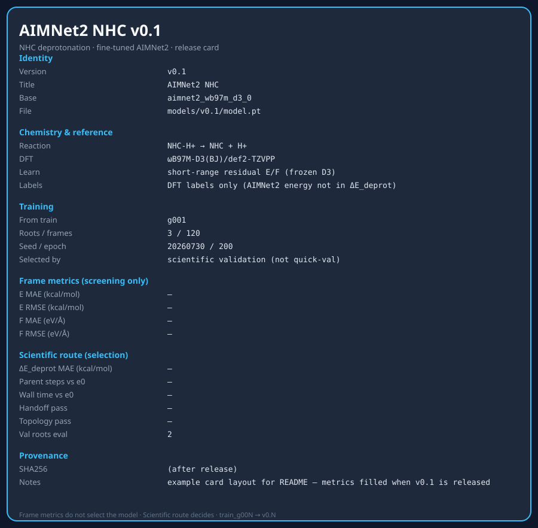

# Fine-Tuning AIMNet2 on ωB97M-D3(BJ)/def2-TZVPP Reference Trajectories for N-Heterocyclic Carbene Deprotonation

氮杂环卡宾（NHC）脱质子：

```math
\mathrm{NHC{-}H^{+}} \rightarrow \mathrm{NHC} + \mathrm{H^{+}}
```

在 **ωB97M-D3(BJ)/def2-TZVPP** 参考轨迹上微调 **AIMNet2**（PySCF 老师帧：几何 / 能量 / 力）。Train 上训练，完整科学 Validation 选模，密封 Final Test 只评一次。标签只认 DFT，AIMNet2 能量不进 $\Delta E_{\mathrm{deprot}}$。

---

## 反应与标签

| | charge | multiplicity |
| --- | ---: | ---: |
| NHC–H⁺ | +1 | 单重态 |
| NHC | 0 | 单重态 |

```math
\Delta E_{\mathrm{elec}} = (E_{\mathrm{neutral}} - E_{\mathrm{cation}}) \times 627.509474
```

```math
\Delta E_{\mathrm{deprot}} = \Delta E_{\mathrm{elec}} - 6.28
```

（kcal·mol⁻¹，越低越好；6.28 为冻结质子常数。）

---

## 计算设定

| | |
| --- | --- |
| 参考 DFT | ωB97M-D3(BJ) / def2-TZVPP，grid 4，SCF $10^{-9}$ |
| AIMNet2 停点 | GAU_LOOSE（五准则 + ASE fmax 0.10 eV/Å） |
| 训练目标 | 冻结 D3 后的短程残差 $E,F$ |
| 评估路线 | AIMNet2 → handoff → 完整 DFT → 标签 |

细节与步骤图见 [`mindmap.md`](mindmap.md)。

---

## 方法总览

从冻结分子与 DFT 参考轨迹，到 AIMNet2 微调、完整几何路线选模，再到密封测试。逐步细节见 [`mindmap.md`](mindmap.md)。



| 阶段 | 要点 |
| --- | --- |
| ① 参考数据 | 冻结 root、互不交叉划分、生成 DFT 老师轨迹 |
| ② Epoch-0 | 未微调模型走完整路线，作微调前对照 |
| ③ 微调 | 只学 Train；快速验证只筛候选 |
| ④ 选模 | 完整几何路线比标签，不靠帧 loss 定终选 |
| ⑤ Final Test | 密封集只考一次 |

**共用几何评估路线**（Epoch-0 / 选模 / Final Test）：

```text
冻结几何 → AIMNet2（GAU_LOOSE）→ exact-byte handoff
        → ωB97M-D3(BJ)/def2-TZVPP 完整优化 → 单点与 ΔE_deprot
```

规模化按 **`g00N`**（每组 5 root = 字典序 3 Train + 2 Val）：

| 工作 | 路径 |
| --- | --- |
| 老师帧 | `teacher_gpu_g00N/` |
| Epoch-0 | `epoch0_val_batches/g00N/` |
| 训练过程 | `train_g00N/` |

进度见 [`progress.md`](progress.md)。

---

## 模型发布

| 训练 | 发布 |
| --- | --- |
| `train_g001/` | **v0.1** → `models/v0.1/` |
| `train_g002/` | **v0.2** → `models/v0.2/` |
| `train_g00N/` | **v0.N** |

```text
models/v0.1/
  model.pt   info.json   card.json   card.svg
```



---

## 仓库与本地

| | |
| --- | --- |
| `mindmap.md` | 科学步骤 |
| `AGENTS.md` | 命名与协作 |
| `progress.md` | 计算进度 |
| `assets/` | README 配图 |
| `src/nhc_deprot/` | 代码 |

```bash
python -m venv .venv && source .venv/bin/activate
pip install -e ".[dev]"
PYTHONPATH=src python -m pytest -q
```

AIMNet2 与 PySCF 分环境使用。
