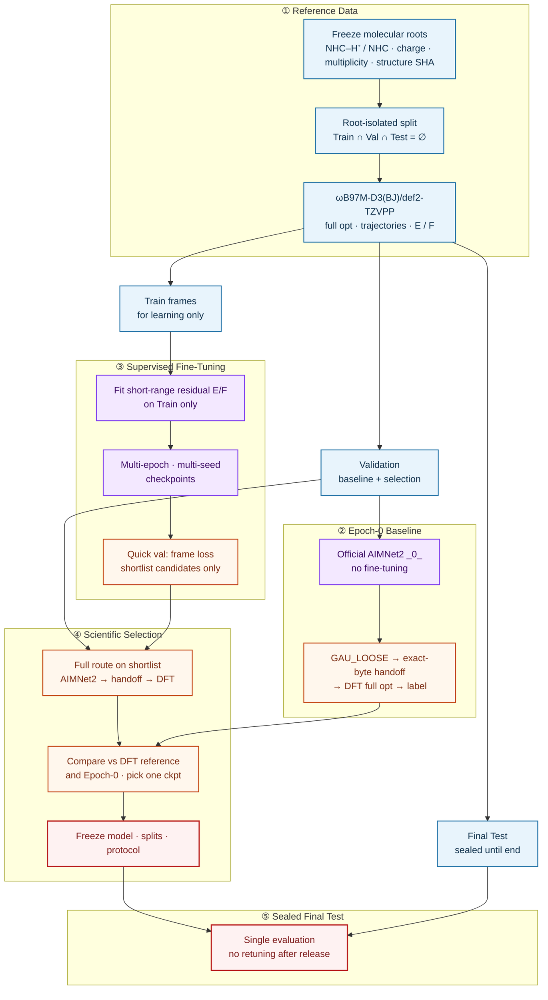

# Fine-Tuning AIMNet2 on ωB97M-D3(BJ)/def2-TZVPP Reference Trajectories for N-Heterocyclic Carbene Deprotonation

**NHC0801** · 本地仓库 `nhc-deprot`

氮杂环卡宾（NHC）脱质子：

```math
\mathrm{NHC{-}H^{+}} \rightarrow \mathrm{NHC} + \mathrm{H^{+}}
```

本项目在 **ωB97M-D3(BJ)/def2-TZVPP** 参考轨迹上微调 **AIMNet2**：用 PySCF 生成老师帧（几何、能量、力），只在 Train 上做有监督训练，再经完整科学 Validation 选出唯一 checkpoint，最后在密封的 **Final Test** 上只评估一次。

科学步骤 0–12 见 **`mindmap.md`**（方框 + 箭头）；协作与实现细节见 **`AGENTS.md`**。

---

## 反应与标签

每个 **molecular root** 同时包含两端点；划分、训练与评估都以 root 为单位，同一分子的 cation / neutral 及其全部轨迹不会拆到不同 split。

| 端点 | charge | multiplicity |
| --- | ---: | ---: |
| NHC–H⁺（cation） | +1 | 单重态 |
| NHC（neutral） | 0 | 单重态 |

脱质子电子能标签（kcal·mol⁻¹，越低越好）：

```math
\Delta E_{\mathrm{elec}} = (E_{\mathrm{neutral}} - E_{\mathrm{cation}}) \times 627.509474
```

```math
\Delta E_{\mathrm{deprot}} = \Delta E_{\mathrm{elec}} - 6.28
```

6.28 为项目冻结的质子相关常数。  
最终标签只来自 **ωB97M-D3(BJ)/def2-TZVPP** 能量；**AIMNet2 能量不进入标签**。

---

## 参考方法与 GAU_LOOSE

老师帧，以及 handoff 之后的完整优化，都固定为 **ωB97M-D3(BJ)/def2-TZVPP**（气相闭壳层 RKS，PySCF + geomeTRIC）：

| 项 | 设定 |
| --- | --- |
| 泛函 / 基组 | ωB97M-D3(BJ) / def2-TZVPP |
| 格点 | grid = 4 |
| SCF | `1e-9` |
| 协议 SHA256 | `227c22a527e567bc4de873ab743fe9f493779eccbb1a698d2913c87695ebf87a` |

AIMNet2 在自身势能面上的收敛合同是 **GAU_LOOSE**（`docs/contracts/GAU_LOOSE_V001.yaml`）。须**同时**满足 geomeTRIC 的五条准则，并配合 ASE LBFGS 的步数与力上限：

| 准则 | 阈值 |
| --- | --- |
| 能量变化 | $\lvert \Delta E \rvert \le 10^{-6}$ Eh |
| 梯度 RMS | $\le 1.7 \times 10^{-3}$ Eh/Bohr |
| 梯度最大值 | $\le 2.5 \times 10^{-3}$ Eh/Bohr |
| 位移 RMS | $\le 6.7 \times 10^{-3}$ Å |
| 位移最大值 | $\le 1.0 \times 10^{-2}$ Å |
| ASE LBFGS | `fmax = 0.10` eV/Å，`max_steps = 100` |

收敛后检查电荷、多重度、质子身份与拓扑等合法性，再做 **exact-byte handoff**，交给同一参考级别做完整几何优化与最终单点（不是只做单点）。

Epoch-0、科学 Validation 与 Final Test 共用同一条骨架：

```text
冻结几何
  → AIMNet2 优化到 GAU_LOOSE
  → 身份 / 拓扑检查
  → exact-byte handoff
  → ωB97M-D3(BJ)/def2-TZVPP 完整优化至收敛
  → 最终单点与脱质子标签
```

再与 **DFT 参考路线**（直接在 ωB97M-D3(BJ)/def2-TZVPP 上完整优化得到的老师参考）对照。

训练学的是冻结两体 D3(BJ) 后的短程残差；推理时加回同一外部 D3：

```math
E_{\mathrm{short}} = E_{\mathrm{DFT,total}} - E_{\mathrm{D3}}, \quad
\mathbf{F}_{\mathrm{short}} = \mathbf{F}_{\mathrm{DFT,total}} - \mathbf{F}_{\mathrm{D3}}
```

其中 $E_{\mathrm{DFT,total}}$ / $\mathbf{F}_{\mathrm{DFT,total}}$ 为 ωB97M-D3(BJ)/def2-TZVPP 总能量与力。

---

## Method Overview

端到端科学工作流：从冻结分子与 DFT 参考轨迹，到 AIMNet2 有监督微调，再到完整几何路线选模与密封测试。  
（GitHub 原生 [Mermaid](https://docs.github.com/en/get-started/writing-on-github/working-with-advanced-formatting/creating-diagrams) 渲染；逐步细节见 [`mindmap.md`](mindmap.md)。）



**读图要点**

| 阶段 | 做什么 | 设计意图 |
| --- | --- | --- |
| ① Reference Data | 冻结 root → 不交叉划分 → DFT 参考轨迹 | 标签可审计；同分子两端点永不跨 split |
| ② Epoch-0 | 官方未微调 AIMNet2 走完整几何路线 | 「微调前」对照，不是终点模型 |
| ③ Fine-Tuning | 仅 Train 帧监督更新；quick-val 只筛候选 | 学习过程与终选分离 |
| ④ Selection | 短名单上完整 GAU_LOOSE → handoff → DFT | 按收敛几何与标签选模，不靠帧 loss 定终身 |
| ⑤ Final Test | 密封集一次性评估 | 开发期不可见身份；考后不改模型 |

**完整几何评估路线**（Epoch-0 / 科学选模 / Final Test 共用）：

```text
冻结几何 → AIMNet2 @ GAU_LOOSE → exact-byte handoff
        → ωB97M-D3(BJ)/def2-TZVPP 完整优化 → 单点与 ΔE_deprot
```

规模化计算按分子组 **`g00N`**（5 root = 3 Train + 2 Val）：老师帧 `teacher_gpu_g00N/`，Epoch-0 `epoch0_val_batches/g00N/`。进度见 [`progress.md`](progress.md)。

---

## 仓库结构

| 路径 | 作用 |
| --- | --- |
| `mindmap.md` | 科学流水线真值 |
| `AGENTS.md` | 协作与落盘约定 |
| `PHASE_STATUS.md` | 阶段状态 |
| `progress.md` | g00N teacher / Epoch-0 进度 |
| `docs/contracts/` | GAU_LOOSE、数值标定、调度等合同 |
| `docs/evidence/` | pilot 证据 |
| `src/nhc_deprot/` | 库代码 |
| `scripts/` | CLI / 作业入口 |
| `tests/` | 合成 fixture 单测 |

科学口径以 `mindmap.md` 与冻结合同为准；实现与协作细节以 `AGENTS.md` 为准。

---

## 本地开发

```bash
cd /path/to/nhc-deprot
python -m venv .venv && source .venv/bin/activate
pip install -e ".[dev]"
PYTHONPATH=src python -m pytest -q
```

不跑化学的预检：

```bash
PYTHONPATH=src python -m nhc_deprot.pipeline.mindmap_orchestrator
```

服务器上 AIMNet2 与 PySCF 分环境使用：

```bash
source $WJW/env/envs/mlff.sh    # AIMNet2
source $WJW/env/envs/molenv.sh  # PySCF
```

---

## 相关文档

| 问题 | 文档 |
| --- | --- |
| 步骤细节 | `mindmap.md` |
| 协作与实现约定 | `AGENTS.md` |
| 算到哪了 | `progress.md`、`PHASE_STATUS.md` |
| g00N / Epoch-0 命名 | `docs/NHC0801_命名与进度指南.md` |
| 选模数值规则 | `docs/contracts/NUMERIC_CALIBRATION_V001.yaml` |

内部科研代码。改科学口径先改 mindmap 与合同，再动实现。
