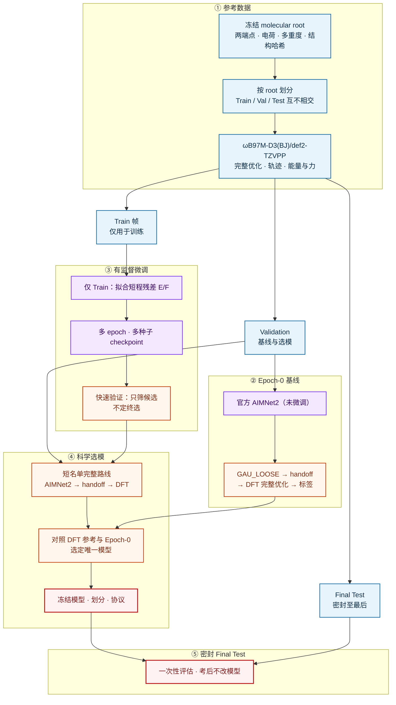

# Fine-Tuning AIMNet2 on ωB97M-D3(BJ)/def2-TZVPP Reference Trajectories for N-Heterocyclic Carbene Deprotonation

氮杂环卡宾（NHC）脱质子：

```math
\mathrm{NHC{-}H^{+}} \rightarrow \mathrm{NHC} + \mathrm{H^{+}}
```

本项目在 **ωB97M-D3(BJ)/def2-TZVPP** 参考轨迹上微调 **AIMNet2**：用 PySCF 生成老师帧（几何、能量、力），只在 Train 上做有监督训练，再经完整科学 Validation 选出唯一 checkpoint，最后在密封的 **Final Test** 上只评估一次。

---

## 反应与标签

每个 **molecular root** 同时包含两端点；划分、训练与评估都以 root 为单位，同一分子的 cation / neutral 及其全部轨迹不会拆到不同 split。

| 端点 | charge | multiplicity |
| --- | ---: | ---: |
| NHC–H⁺（cation） | +1 | 单重态 |
| NHC（neutral） | 0 | 单重态 |

脱质子电子能标签（kcal·mol⁻¹，越低越好）：

```math
\Delta E_{\mathrm{elec}} = (E_{\mathrm{neutral}} - E_{\mathrm{cation}}) \times 627.509474
```

```math
\Delta E_{\mathrm{deprot}} = \Delta E_{\mathrm{elec}} - 6.28
```

6.28 为项目冻结的质子相关常数。  
最终标签只来自 **ωB97M-D3(BJ)/def2-TZVPP** 能量；**AIMNet2 能量不进入标签**。

---

## 电子结构方法与几何收敛

老师轨迹，以及 handoff 后的完整优化，均在 **ωB97M-D3(BJ)/def2-TZVPP** 下完成（气相闭壳层 RKS；PySCF + geomeTRIC）：

| 项 | 设定 |
| --- | --- |
| 泛函 / 基组 | ωB97M-D3(BJ) / def2-TZVPP |
| 积分格点 | grid level 4 |
| SCF 收敛 | $10^{-9}$ |

AIMNet2 在自身势能面上优化时，采用 geomeTRIC 的 **GAU_LOOSE** 收敛阈值（五条同时满足），并配合 ASE LBFGS：

| 准则 | 阈值 |
| --- | --- |
| 能量变化 | $\lvert \Delta E \rvert \le 10^{-6}$ Eh |
| 梯度 RMS | $\le 1.7 \times 10^{-3}$ Eh/Bohr |
| 梯度最大值 | $\le 2.5 \times 10^{-3}$ Eh/Bohr |
| 位移 RMS | $\le 6.7 \times 10^{-3}$ Å |
| 位移最大值 | $\le 1.0 \times 10^{-2}$ Å |
| ASE LBFGS | `fmax = 0.10` eV/Å，最多 100 步 |

收敛后检查电荷、多重度、质子身份与拓扑，再将几何 **按字节原样** 交给同一 DFT 级别做完整优化与最终单点（不是只做单点）。

Epoch-0、科学 Validation 与 Final Test 共用：

```text
冻结几何
  → AIMNet2 优化至 GAU_LOOSE
  → 身份 / 拓扑检查
  → 几何 handoff
  → ωB97M-D3(BJ)/def2-TZVPP 完整优化
  → 最终单点与脱质子标签
```

对照路线为：直接在同一 DFT 级别上完整优化得到的参考轨迹与标签。

训练目标是扣除冻结两体 D3(BJ) 后的短程残差；推理时加回同一外部 D3：

```math
E_{\mathrm{short}} = E_{\mathrm{DFT,total}} - E_{\mathrm{D3}}, \quad
\mathbf{F}_{\mathrm{short}} = \mathbf{F}_{\mathrm{DFT,total}} - \mathbf{F}_{\mathrm{D3}}
```

其中 $E_{\mathrm{DFT,total}}$ / $\mathbf{F}_{\mathrm{DFT,total}}$ 为 ωB97M-D3(BJ)/def2-TZVPP 总能量与力。
---

## 方法总览

从冻结分子与 DFT 参考轨迹，到 AIMNet2 微调、完整几何路线选模，再到密封测试。细节见 [`mindmap.md`](mindmap.md)。



| 阶段 | 要点 |
| --- | --- |
| ① 参考数据 | 冻结 root、互不交叉划分、生成 DFT 老师轨迹 |
| ② Epoch-0 | 未微调模型走完整路线，作微调前对照 |
| ③ 微调 | 只学 Train；快速验证只筛候选 |
| ④ 选模 | 完整几何路线比标签，不靠帧 loss 定终选 |
| ⑤ Final Test | 密封集只考一次 |

**共用几何评估路线**（Epoch-0 / 选模 / Final Test）：

```text
冻结几何 → AIMNet2（GAU_LOOSE）→ exact-byte handoff
        → ωB97M-D3(BJ)/def2-TZVPP 完整优化 → 单点与 ΔE_deprot
```

规模化按 **`g00N`**（5 root = 3 Train + 2 Val）：老师帧 `teacher_gpu_g00N/`，Epoch-0 `epoch0_val_batches/g00N/`。进度见 [`progress.md`](progress.md)。

---

## 仓库结构

| 路径 | 作用 |
| --- | --- |
| `mindmap.md` | 科学流水线真值 |
| `AGENTS.md` | 协作与落盘约定 |
| `PHASE_STATUS.md` | 阶段状态 |
| `progress.md` | g00N teacher / Epoch-0 进度 |
| `docs/contracts/` | GAU_LOOSE、数值标定、调度等合同 |
| `docs/evidence/` | pilot 证据 |
| `src/nhc_deprot/` | 库代码 |
| `scripts/` | CLI / 作业入口 |
| `tests/` | 合成 fixture 单测 |

科学口径以 `mindmap.md` 与冻结合同为准；实现与协作细节以 `AGENTS.md` 为准。

---

## 本地开发

```bash
cd /path/to/nhc-deprot
python -m venv .venv && source .venv/bin/activate
pip install -e ".[dev]"
PYTHONPATH=src python -m pytest -q
```

不跑化学的预检：

```bash
PYTHONPATH=src python -m nhc_deprot.pipeline.mindmap_orchestrator
```

服务器上 AIMNet2 与 PySCF 分环境使用：

```bash
source $WJW/env/envs/mlff.sh    # AIMNet2
source $WJW/env/envs/molenv.sh  # PySCF
```

---

## 相关文档

| 问题 | 文档 |
| --- | --- |
| 步骤细节 | `mindmap.md` |
| 协作与实现约定 | `AGENTS.md` |
| 算到哪了 | `progress.md`、`PHASE_STATUS.md` |
| g00N / Epoch-0 命名 | `docs/NHC0801_命名与进度指南.md` |
| 选模数值规则 | `docs/contracts/NUMERIC_CALIBRATION_V001.yaml` |

内部科研代码。改科学口径先改 mindmap 与合同，再动实现。
